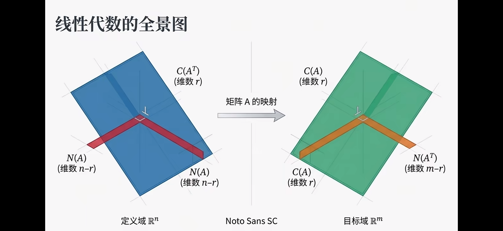
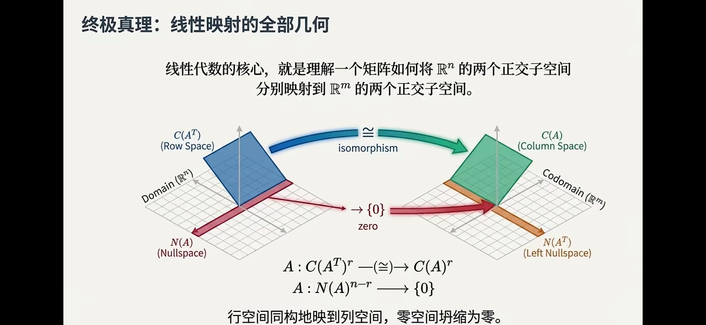
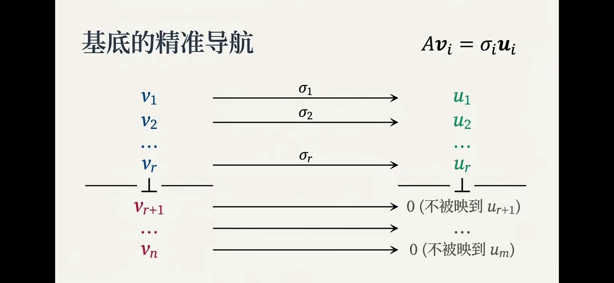
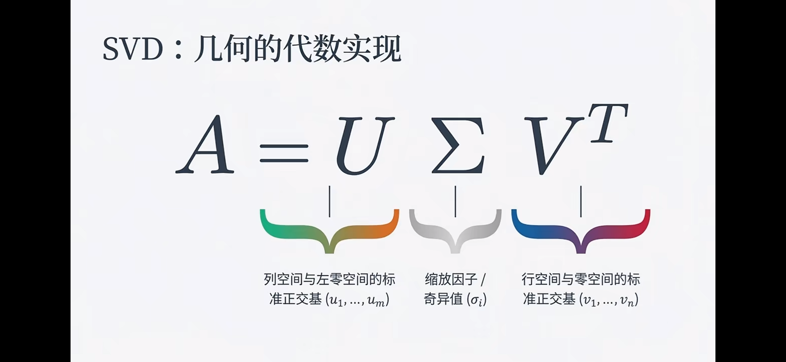

# 线性代数：四个基本子空间 (Four Fundamental Subspaces)

Updated: 2026-03-19 11:35 AEDT

标签约定：`Definition` 表示定义，`Theory` 表示理论/定理，`Inference` 仅表示推导步骤，`Result` 表示结论或应用结论。

## 1. 问题设定 (Problem Setup)

**Definition.** 给定矩阵：

$$
A\in\mathbb{R}^{m\times n},\quad A:\mathbb{R}^n\to\mathbb{R}^m
$$

它对应四个核心子空间：

- Column Space（列空间）$C(A)\subseteq\mathbb{R}^m$
- Row Space（行空间）$C(A^T)\subseteq\mathbb{R}^n$
- Null Space（零空间）$N(A)\subseteq\mathbb{R}^n$
- Left Null Space（左零空间）$N(A^T)\subseteq\mathbb{R}^m$

**Result.** 四子空间把输入空间和输出空间分别拆成两块正交结构，是理解 `Ax=b`、最小二乘和 SVD 的统一框架。

{fig-cap="四子空间的核心几何：行空间与列空间在秩 r 维子空间上同构，零空间被压到 0。" width="100%"}

## 2. 列空间与可达输出 (Column Space)

**Definition.** 列空间定义为：

$$
C(A)=\{Ax\mid x\in\mathbb{R}^n\}
$$

**Inference.** 若记 $A=[a_1,\dots,a_n]$，则：

$$
Ax=\sum_{i=1}^n x_i a_i
$$

即输出是列向量的线性组合。

**Result.** 方程 `Ax=b` 有解当且仅当：

$$
b\in C(A)
$$

## 3. 零空间与解的不唯一性 (Null Space)

**Definition.** 零空间定义为：

$$
N(A)=\{x\in\mathbb{R}^n\mid Ax=0\}
$$

**Theory.** 若 $x_p$ 是 `Ax=b` 的一个特解，则任意解可写成：

$$
x=x_p+x_n,\quad x_n\in N(A)
$$

**Result.** 解是否唯一由 $N(A)$ 决定。若 $N(A)=\{0\}$，则解唯一。

## 4. 行空间与左零空间 (Row Space and Left Null Space)

**Definition.** 行空间是：

$$
C(A^T)=\operatorname{span}\{\text{A 的行向量}\}\subseteq\mathbb{R}^n
$$

**Definition.** 左零空间是：

$$
N(A^T)=\{y\in\mathbb{R}^m\mid A^Ty=0\}
$$

**Theory.** 行空间描述“输入中可被检测到的方向”，左零空间描述“输出中与所有可达输出正交的方向”。

## 5. 正交补关系 (Orthogonal Complements)

**Theory.** 四子空间满足两组正交补：

$$
\mathbb{R}^n=C(A^T)\oplus N(A),\quad C(A^T)\perp N(A)
$$

$$
\mathbb{R}^m=C(A)\oplus N(A^T),\quad C(A)\perp N(A^T)
$$

**Inference.** 若 $x_r\in C(A^T),x_n\in N(A)$，则：

$$
x_r^Tx_n=0
$$

若 $b_c\in C(A),b_\ell\in N(A^T)$，则：

$$
b_c^Tb_\ell=0
$$

**Result.** 输入与输出空间都可分解为“有效部分 + 被抹除/不可达部分”。

{fig-cap="输入空间与输出空间的对应分解：C(A^T) ⊕ N(A) 经过 A 映射到 C(A) ⊕ N(A^T)。" width="100%"}

## 6. 秩与维度分配 (Rank and Dimension)

**Definition.** 设：

$$
\operatorname{rank}(A)=r
$$

**Result.** 四个子空间的维度为：

$$
\dim C(A)=r,\quad \dim C(A^T)=r
$$

$$
\dim N(A)=n-r,\quad \dim N(A^T)=m-r
$$

这给出秩-零度定理：

$$
n=\operatorname{rank}(A)+\operatorname{nullity}(A)
$$

## 7. 输入分解与矩阵“过滤” (Input Decomposition)

**Theory.** 任意输入 $x\in\mathbb{R}^n$ 都可唯一写成：

$$
x=x_r+x_n,\quad x_r\in C(A^T),\ x_n\in N(A)
$$

**Inference.**

$$
Ax=A(x_r+x_n)=Ax_r+Ax_n=Ax_r
$$

因为 $Ax_n=0$。

**Result.** 矩阵乘法像一个过滤器：零空间方向被完全压缩，只保留行空间方向的贡献。

## 8. 方程 `Ax=b` 的判据 (Solvability and General Solution)

**Theory.** `Ax=b` 有解等价于：

$$
b\in C(A)\iff b\perp N(A^T)
$$

**Result.**

- 可解时，通解为 $x=x_p+x_n,\ x_n\in N(A)$。
- 不可解时，说明 $b$ 含有左零空间分量，无法由 $Ax$ 生成。

## 9. 最小二乘与残差空间 (Least Squares and Residual)

**Theory.** 当 `Ax=b` 无精确解时，最小二乘寻找：

$$
\hat{x}=\arg\min_x\|Ax-b\|_2^2
$$

满足正规方程：

$$
A^TA\hat{x}=A^Tb
$$

**Result.** 残差 $r=b-A\hat{x}$ 满足：

$$
r\in N(A^T),\quad r\perp C(A)
$$

即把 $b$ 正交投影到列空间后留下的“不可达部分”。

## 10. SVD 与四子空间 (SVD View)

**Theory.** 奇异值分解：

$$
A=U\Sigma V^T
$$

其中 $U,V$ 正交，$\Sigma$ 的非零奇异值个数为 $r$。

{fig-cap="SVD 把线性映射分成三步：右正交基变换、奇异值缩放、左正交基变换。" width="100%"}

**Result.** 若按非零奇异值排序，则：

$$
C(A)=\operatorname{span}(u_1,\dots,u_r),\quad N(A^T)=\operatorname{span}(u_{r+1},\dots,u_m)
$$

$$
C(A^T)=\operatorname{span}(v_1,\dots,v_r),\quad N(A)=\operatorname{span}(v_{r+1},\dots,v_n)
$$

{fig-cap="前 r 个右奇异向量 v_i 被映射到对应左奇异向量 u_i（缩放系数为 σ_i），其余落入零空间方向。" width="100%"}

SVD 直接给出四子空间的一组标准正交基。
